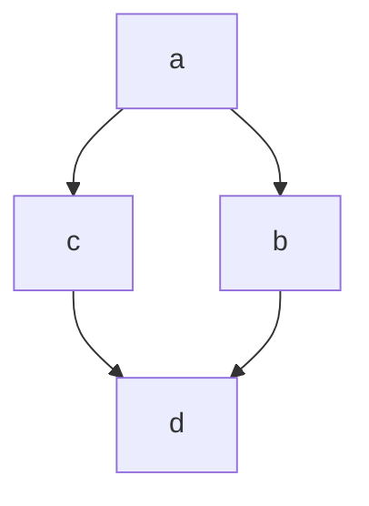

## Links

[ Clique aqui ](https://meupc.net/build/f3CT4D "PC")

[Ancora](#markdown)
[links](#links)

## Imagens


## Imagem com link

[](https://mail.google.com/mail/u/0/?tab=rm&ogbl#inbox)

## Citação
> Iniciar minha citação

> <br>
> Iniciar minha citação
> <br><br>

> Citação
>> sub citação
>### hiiiiiiiiiiiiiiiiii

## Toggle

<details>
    <summary>
    Clique aqui para ver:
    </sumamary>
    Conteudo
</details>

## Separador

Pode ser 3 traços

---

Ou 3 asteriscos

***

## Checklist

- [ ] Item 1
- [ ] Item 2
- [x] Item 3

## Tabela

| Nome | Idade |
| ---- | ---- |
| Lucas | 17 |
| Thiago | 18 |
| Bruna | 17 |

| Nome | Idade |
| ---- | ----: |
| Lucas | 17 |
| Thiago | 18 |
| Bruna | 17 |

| Nome | Idade |
| :----: | :----: |
| Lucas | 17 |
| Thiago | 18 |
| Bruna | 17 |

## Código

Em linha usamos 1 acento grave para abrir o código e outro para fechar

` <h1> Eu sou um título</h1> `

<h1> Eu sou um título</h1>

` # Eu sou um título `

# Eu sou um título

` console.log('Olá, mundo!') `

### Bloco de códigos
Usaremos 3 acentos graves para abrir, seguidos da linguagem que eu quero e, para fechar, mais 3 acentos graves.

``` html

<details>
    <summary>
    Clique aqui para ver:
    </sumamary>
    Conteudo
</details>

```

``` css

.container{
    display:flex;
}

```

``` javascript

console.log('Olá, mundo!');

function dados(dados){
    console.log(dados);
}

```

## Emojis

:rocket:
:smirk:
:elephant:

:s
:D




<!-- comentario -->
